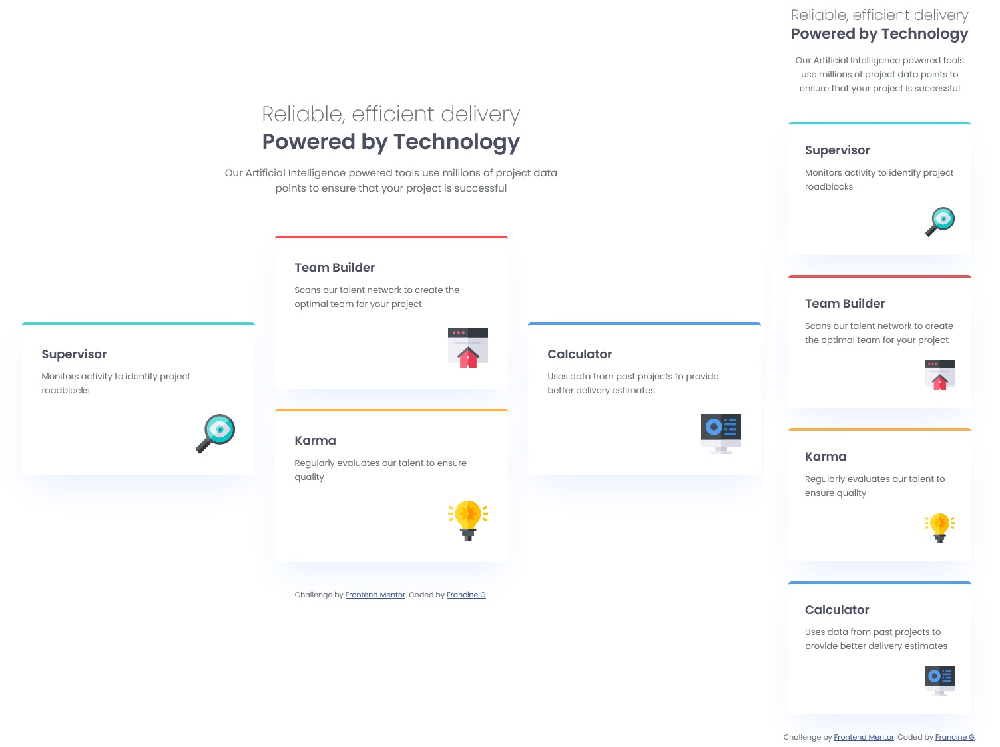
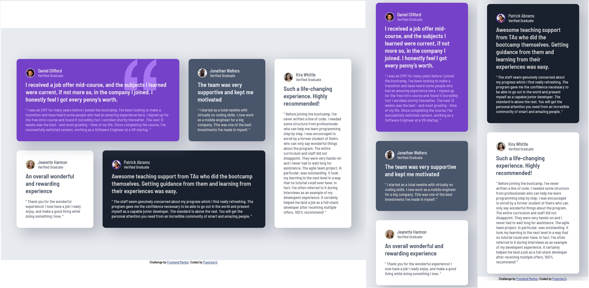
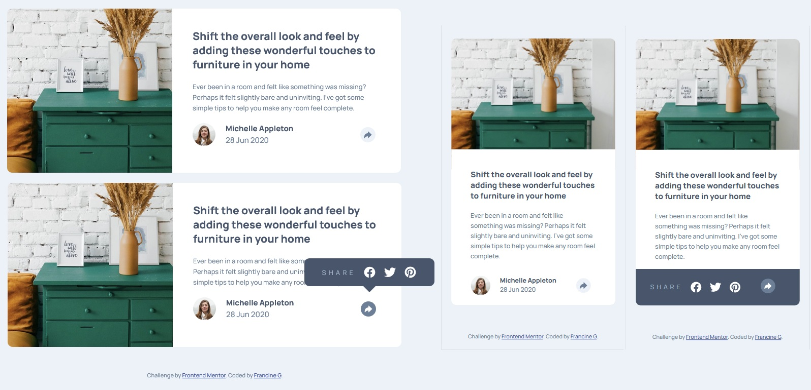

# Projetos HTML + CSS

 Coleção de projetos utilizando HTML e CSS para práticar

---
### QR code component challenge on Frontend Mentor.

---

### Blog preview card challenge on Frontend Mentor

---

### Social links profile challenge on Frontend Mentor

---

### Recipe page challenge on Frontend Mentor

---

### Product preview card component challenge on Frontend Mentor

---

### Product preview card component challenge on Frontend Mentor

---

### Testimonials grid section challenge on Frontend Mentor

---

### Article preview component challenge on Frontend Mentor

